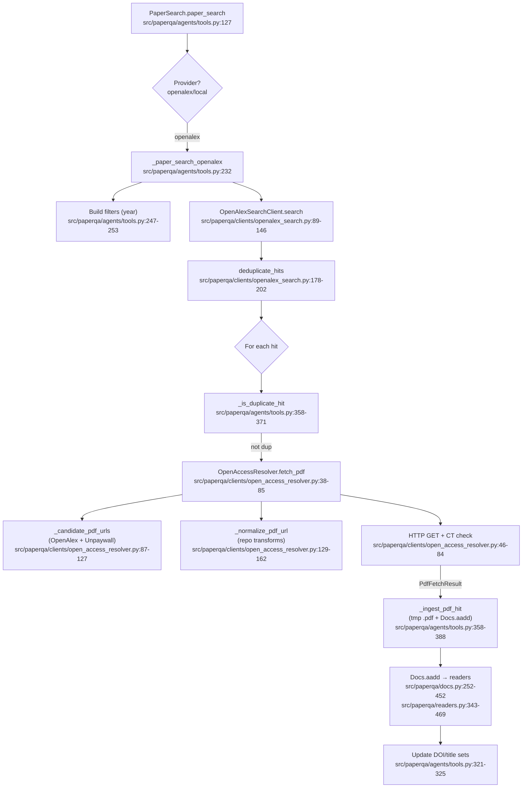

# Literature Search Pipeline — Previous vs New Logic

This document diagrams the OpenAlex-based literature search pipeline as implemented before and after the latest resolver and ingestion improvements. Each node includes the file path and line reference. Commit `e98dbc7` is the baseline for the “Previous Logic”.

## Previous Logic (commit e98dbc7)

```mermaid
flowchart TD
  A[PaperSearch.paper_search\nsrc/paperqa/agents/tools.py:127] --> B{Provider?\nopenalex/local}
  B -- openalex --> C[_paper_search_openalex\nsrc/paperqa/agents/tools.py:232]
  C --> C1[Build filters (year)\nsrc/paperqa/agents/tools.py:247-253]
  C --> C2[OpenAlexSearchClient.search\nsrc/paperqa/clients/openalex_search.py:89-146]
  C2 --> C3[deduplicate_hits\nsrc/paperqa/clients/openalex_search.py:178-202]
  C3 --> D{For each hit}
  D --> D1[_is_duplicate_hit\nsrc/paperqa/agents/tools.py:358-371]
  D1 -- not dup --> E[OpenAccessResolver.fetch_pdf\nsrc/paperqa/clients/open_access_resolver.py:38-85]
  E --> E1[_candidate_pdf_urls\n(OpenAlex + Unpaywall)\nsrc/paperqa/clients/open_access_resolver.py:87-127]
  E --> E2[_normalize_pdf_url\n(repo transforms)\nsrc/paperqa/clients/open_access_resolver.py:129-162]
  E --> E3[HTTP GET + CT check\nsrc/paperqa/clients/open_access_resolver.py:46-84]
  E3 -->|PdfFetchResult| F[_ingest_pdf_hit\n(tmp .pdf + Docs.aadd)\nsrc/paperqa/agents/tools.py:358-388]
  F --> G[Docs.aadd → readers\nsrc/paperqa/docs.py:252-452\nsrc/paperqa/readers.py:343-469]
  G --> H[Update DOI/title sets\nsrc/paperqa/agents/tools.py:321-325]
```

Key characteristics:
- PDF-only resolution via Unpaywall + OpenAlex hints.
- No HTML/JATS ingestion; minimal format probing.
- No explicit OA filter at query time; relies on location hints later.
- Concurrency and RPS are implicit (client defaults), no per-host shaping.

## New Logic (workspace)


```mermaid
flowchart TD
  A[PaperSearch.paper_search\nsrc/paperqa/agents/tools.py:127] --> B{Provider?}
  B -- openalex --> C[_paper_search_openalex\nsrc/paperqa/agents/tools.py:235]
  C --> C0[Add OA filter is_oa:true\nsrc/paperqa/agents/tools.py:257-258]
  C --> C1[OpenAlexSearchClient.search\nsrc/paperqa/clients/openalex_search.py:89-146]
  C1 --> C2[deduplicate_hits\nsrc/paperqa/clients/openalex_search.py:178-202]
  C2 --> D{For each hit}
  D --> D1[_is_duplicate_hit\nsrc/paperqa/agents/tools.py:358-371]
  D1 -- not dup --> E[OpenAccessResolver.fetch_fulltext\nJATS/HTML/PDF priority\nsrc/paperqa/clients/open_access_resolver.py:87-147]
  E --> E1[enumerate_candidates\n(OpenAlex + Unpaywall + transforms)\nsrc/paperqa/clients/open_access_resolver.py:149-225]
  E --> E2[rescore/sort by format\nsrc/paperqa/clients/open_access_resolver.py:242-273]
  E --> E3[Domain allow/block + robots.txt\nsrc/paperqa/clients/open_access_resolver.py:121-132\npolicy: src/paperqa/net/policy.py:34-44, 76-101]
  E --> E4[Probe + stream fetch (size/time)\nsrc/paperqa/clients/open_access_resolver.py:274-357]
  E4 --> E4a[Classify PDF/HTML/JATS\nsrc/paperqa/clients/open_access_resolver.py:318-353, 460-470]
  E4 --> E4b[License resolve + gate\nsrc/paperqa/clients/open_access_resolver.py:138-146\npolicy: src/paperqa/net/policy.py:46-53, 55-73]
  E4 -->|FulltextFetchResult| F[_ingest_fulltext_hit\n(tmp .pdf/.html/.xml + Docs.aadd)\nsrc/paperqa/agents/tools.py:373-405]
  F --> G[Docs.aadd → readers (HTML/JATS enabled)\nsrc/paperqa/readers.py:384-387, 440-451]
  G --> H[Dedup by sha256 before adding\nsrc/paperqa/agents/tools.py:303-336]
  H --> I[Update DOI/title sets\nsrc/paperqa/agents/tools.py:336-340]
```

Notable additions and controls:
- OA filtering at query time: `is_oa:true` (tools.py:257-258).
- Full-text priority: JATS → HTML → PDF with scoring (open_access_resolver.py:242-273).
- Candidate expansion from Unpaywall and repo transforms (open_access_resolver.py:149-225).
- Streaming fetch with size/time guards and %PDF-/HTML sniff (open_access_resolver.py:274-357, 318-353, 460-470).
- Domain allow/block and robots.txt checks (open_access_resolver.py:121-132; policy.py:34-44, 76-101).
- License resolution and gating (policy.py:46-53, 55-73; resolver:138-146).
- Per-host RPS shaping + concurrency semaphore (open_access_resolver.py:76-85, 355-429).
- SHA-256 content de-duplication during ingestion (tools.py:303-336).
- HTML and JATS ingestion wired through readers (readers.py:384-387, 440-451).

## Settings Added (knobs)

- require_open_access (src/paperqa/settings.py:695-701)
- prefer_fulltext_order (src/paperqa/settings.py:702-708)
- allow_bronze (src/paperqa/settings.py:709-715)
- html_ingest_enabled (src/paperqa/settings.py:716-719)
- jats_ingest_enabled (src/paperqa/settings.py:720-723)
- allow_domains / block_domains (src/paperqa/settings.py:724-746)
- respect_robots_txt (src/paperqa/settings.py:747-750)
- http_per_host_rps / http_max_concurrent_downloads (src/paperqa/settings.py:751-759)
- http_timeout_s / http_stream_peek_bytes (src/paperqa/settings.py:760-768)
- max_pdf_mb / max_html_mb (src/paperqa/settings.py:769-778)
- per_work_resolution_budget_s / per_link_timeout_s (src/paperqa/settings.py:779-786)

## Legend

- Rectangles indicate functions or major steps with code references.
- Diamonds indicate decisions/loops.
- Line references use the current workspace for “New Logic” and commit `e98dbc7` for “Previous Logic”.

