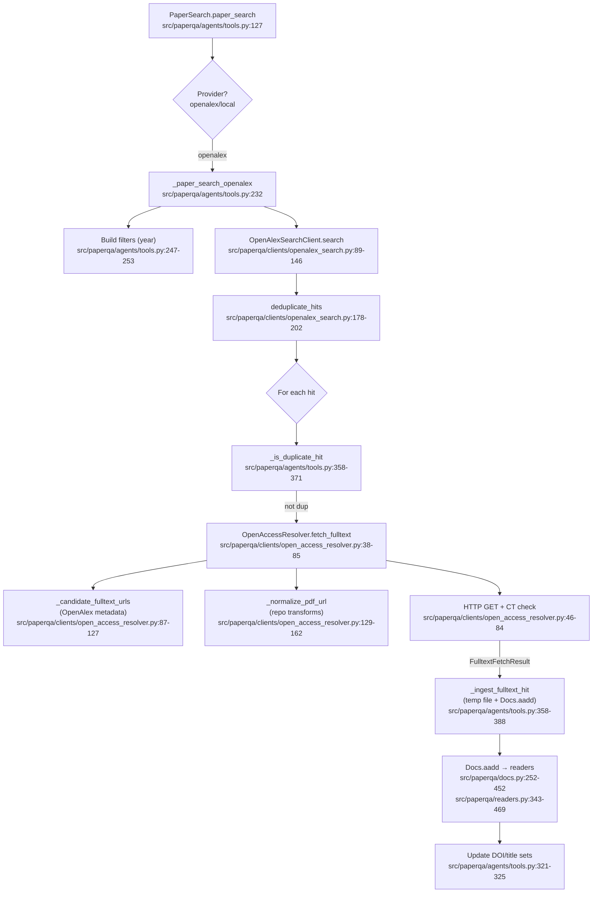

```mermaid
graph TD
  A["PaperSearch.paper_search<br>src/paperqa/agents/tools.py:127"] --> B{"Provider?<br>openalex/local"}
  B -- openalex --> C["_paper_search_openalex<br>src/paperqa/agents/tools.py:232"]
  C --> C1["Build filters (year)<br>src/paperqa/agents/tools.py:247-253"]
  C --> C2["OpenAlexSearchClient.search<br>src/paperqa/clients/openalex_search.py:89-146"]
  C2 --> C3["deduplicate_hits<br>src/paperqa/clients/openalex_search.py:178-202"]
  C3 --> D{"For each hit"}
  D --> D1["_is_duplicate_hit<br>src/paperqa/agents/tools.py:358-371"]
  D1 -->|not dup| E["OpenAccessResolver.fetch_fulltext<br>src/paperqa/clients/open_access_resolver.py:38-85"]
  E --> E1["_candidate_fulltext_urls<br>(OpenAlex metadata)<br>src/paperqa/clients/open_access_resolver.py:87-127"]
  E --> E2["_normalize_pdf_url<br>(repo transforms)<br>src/paperqa/clients/open_access_resolver.py:129-162"]
  E --> E3["HTTP GET + CT check<br>src/paperqa/clients/open_access_resolver.py:46-84"]
  E3 -->|FulltextFetchResult| F["_ingest_fulltext_hit<br>(temp file + Docs.aadd)<br>src/paperqa/agents/tools.py:358-388"]
  F --> G["Docs.aadd → readers<br>src/paperqa/docs.py:252-452<br>src/paperqa/readers.py:343-469"]
  G --> H["Update DOI/title sets<br>src/paperqa/agents/tools.py:321-325"]
```
