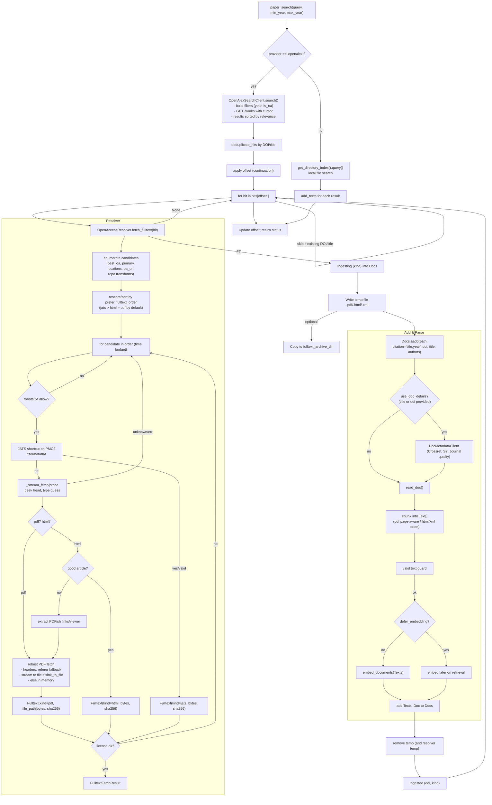

```mermaid
flowchart TD
Q["paper_search(query, min_year, max_year)"] --> P{"provider == 'openalex'?"}
P -- yes --> OA["OpenAlexSearchClient.search()<br/>- build filters (year, is_oa)<br/>- GET /works with cursor<br/>- results sorted by relevance"]
OA --> DEDUP["deduplicate_hits by DOI/title"]
DEDUP --> OFFS["apply offset (continuation)"]
OFFS --> LOOP["for hit in hits[offset:]"]
LOOP -->|skip if existing DOI/title| LOOP
LOOP --> RESOLVE["OpenAccessResolver.fetch_fulltext(hit)"]
subgraph RESOLVER ["Resolver"]
  RESOLVE --> ENUM["enumerate candidates<br/>(best_oa, primary, locations, oa_url,<br/>repo transforms)"]
  ENUM --> SCORE["rescore/sort by prefer_fulltext_order<br/>(jats > html > pdf by default)"]
  SCORE --> TRY["for candidate in order (time budget)"]
  TRY --> ROBOTS{"robots.txt allow?"}
  ROBOTS -- no --> TRY
  ROBOTS -- yes --> JATS["JATS shortcut on PMC?<br/>?format=flat"]
  JATS -- yes/valid --> FTJ["Fulltext(kind=jats, bytes, sha256)"]
  JATS -- no --> PROBE["_stream_fetch/probe<br/>peek head, type guess"]
  PROBE --> DECIDE{"pdf? html?"}
  DECIDE -- pdf --> PDF["robust PDF fetch<br/>- headers, referer fallback<br/>- stream to file if sink_to_file<br/>- else in memory"]
  PDF --> FTP["Fulltext(kind=pdf, file_path|bytes, sha256)"]
  DECIDE -- html --> HCHK{"good article?"}
  HCHK -- yes --> FTH["Fulltext(kind=html, bytes, sha256)"]
  HCHK -- no --> EXTL["extract PDFish links/viewer"]
  EXTL --> PDF
  PROBE -- unknown/err --> TRY
  FTP --> LIC{"license ok?"}
  FTH --> LIC
  FTJ --> LIC
  LIC -- yes --> FT["FulltextFetchResult"]
  LIC -- no --> TRY
end
RESOLVE -->|None| LOOP
RESOLVE -->|FT| ING["Ingesting (kind) into Docs"]
ING --> TMP["Write temp file .pdf/.html/.xml"]
TMP -->|optional| ARCH["Copy to fulltext_archive_dir"]
TMP --> AADD["Docs.aadd(path,<br/>citation='title,year', doi, title, authors)"]
subgraph ADD_PARSE ["Add & Parse"]
  AADD --> META{"use_doc_details?<br/>(title or doi provided)"}
  META -- yes --> HYDR["DocMetadataClient (Crossref, S2, Journal quality)"]
  META -- no --> RD["read_doc()"]
  HYDR --> RD
  RD --> CHUNK["chunk into Text[]<br/>(pdf page-aware / html/xml token)"]
  CHUNK --> VALID["valid text guard"]
  VALID -- ok --> EMB{"defer_embedding?"}
  EMB -- no --> EMBB["embed_documents(Texts)"]
  EMB -- yes --> SKIPE["embed later on retrieval"]
  EMBB --> ADD["add Texts, Doc to Docs"]
  SKIPE --> ADD
end
ADD --> CLEAN["remove temp (and resolver temp)"]
CLEAN --> LOG["Ingested (doi, kind)"]
LOG --> LOOP
LOOP --> DONE["Update offset; return status"]

%% local provider branch
P -- no --> LOCAL["get_directory_index().query()<br/>local file search"]
LOCAL --> ALOC["add_texts for each result"]
ALOC --> DONE
```
